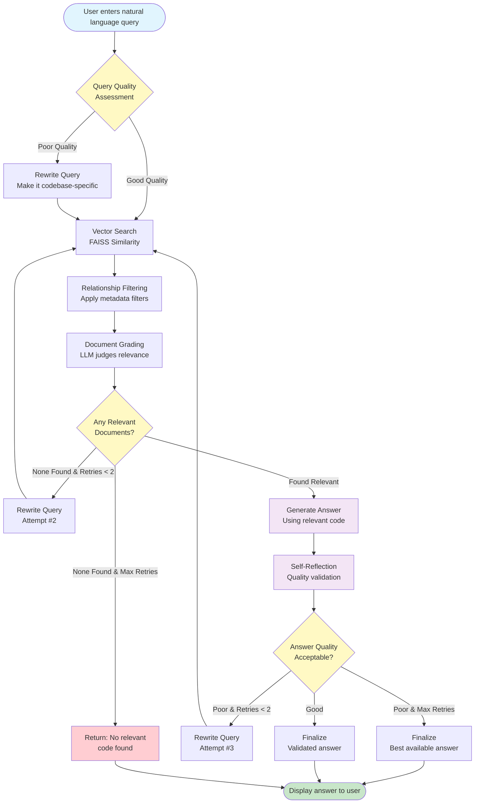
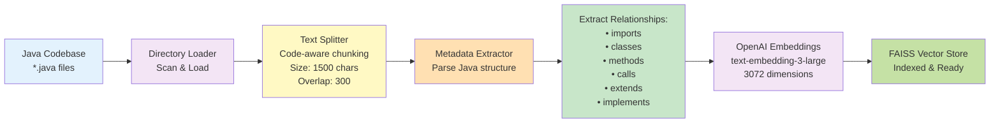
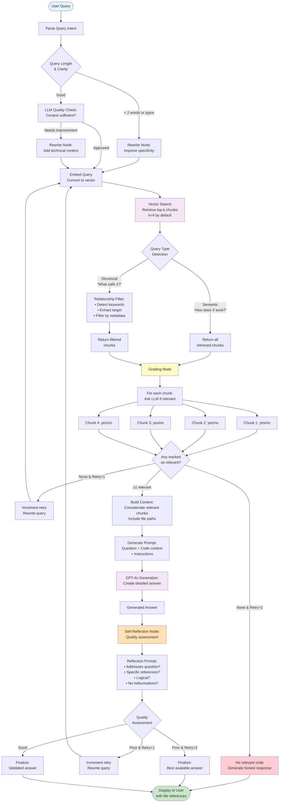
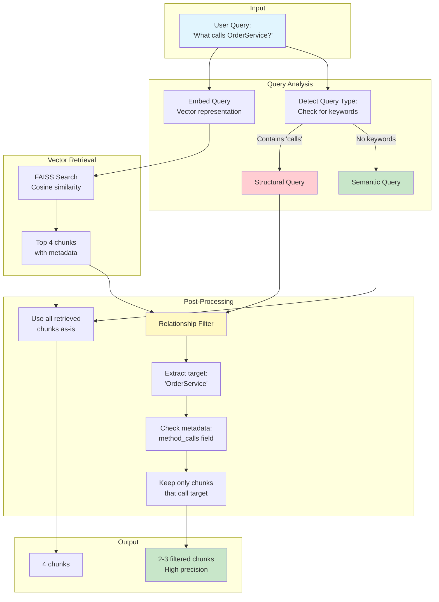
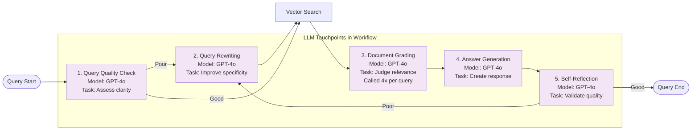
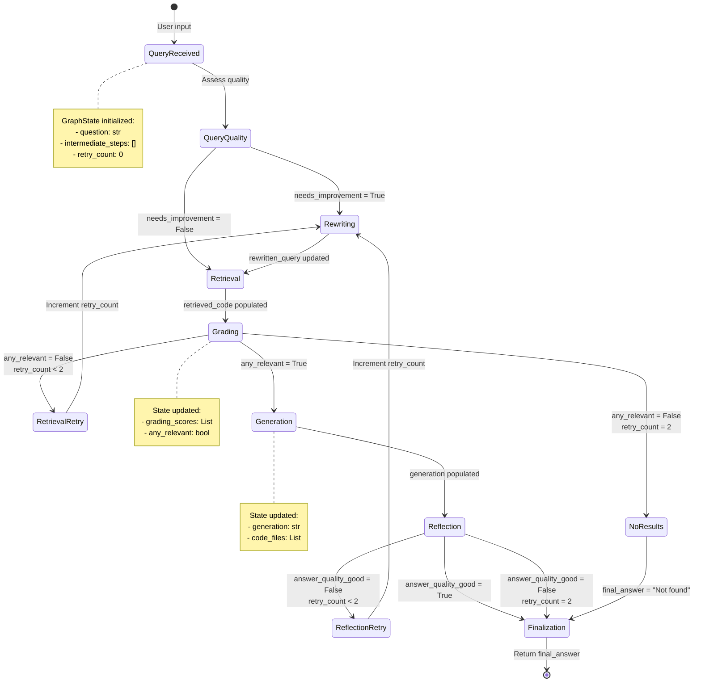
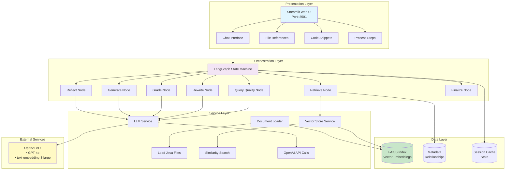
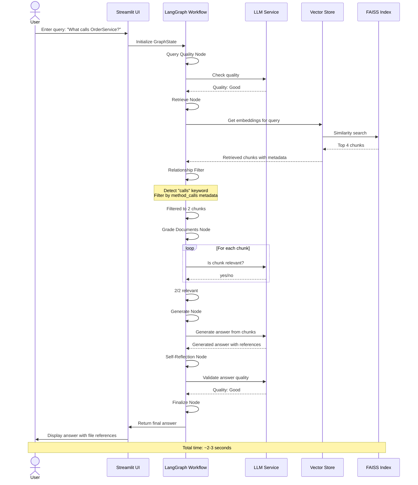
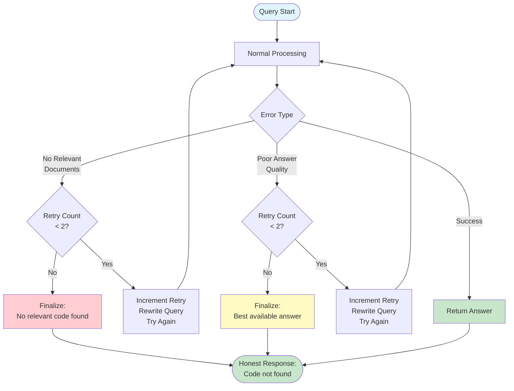
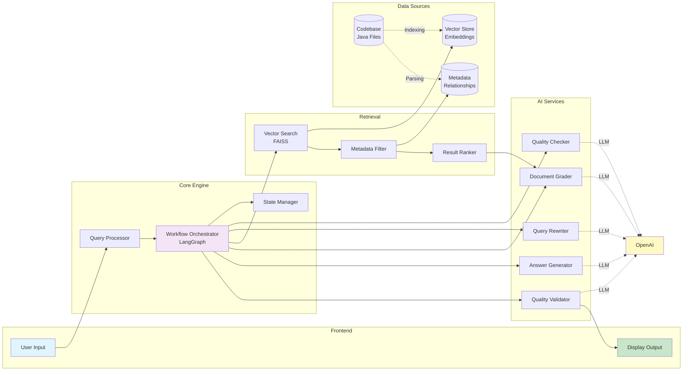

# Intelligent Code Insights - Professional Flow Diagrams

## 1. Complete System Flow - High Level



## 2. Indexing Pipeline Flow



## 3. Query Processing - Detailed Workflow



## 4. Retrieval Strategy - Hybrid Approach



## 5. LLM Interaction Points



## 6. State Management Flow



## 7. Architecture Layers



## 8. Data Flow - End to End



## 9. Error Handling and Retry Logic



## 10. Component Interaction Diagram



## How to View These Diagrams

### Option 1: GitHub (Recommended)
- Push this file to GitHub
- Diagrams render automatically with Mermaid support

### Option 2: VS Code
- Install "Markdown Preview Mermaid Support" extension
- Open this file and preview (Ctrl+Shift+V)

### Option 3: Online Viewer
- Visit: https://mermaid.live/
- Copy diagram code and paste
- Export as PNG/SVG

### Option 4: Convert to Images
```bash
# Install mermaid-cli
npm install -g @mermaid-js/mermaid-cli

# Convert to PNG
mmdc -i FLOW_DIAGRAM_PROFESSIONAL.md -o diagrams/
```

## Diagram Legend

| Color | Meaning |
|-------|---------|
| 🔵 Blue (`#e1f5fe`) | Input/Start points |
| 🟢 Green (`#c8e6c9`) | Success/Output points |
| 🟡 Yellow (`#fff9c4`) | Decision points |
| 🟣 Purple (`#f3e5f5`) | Processing/LLM nodes |
| 🔴 Red (`#ffcdd2`) | Error/Failure states |
| 🟠 Orange (`#ffe0b2`) | Intermediate processing |

---

**Created for**: Intelligent Code Insights Technical Documentation
**Version**: 1.0
**Date**: January 2025
